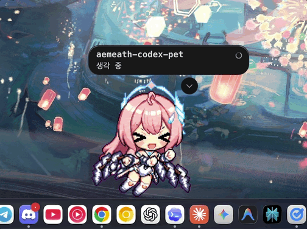
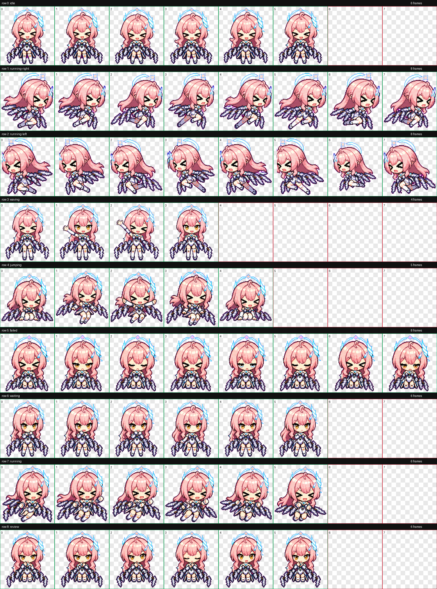

# Aemeath Codex Pet

에이메스(Aemeath)를 바탕으로 만든 비공식 Codex 커스텀 펫입니다. Codex Desktop의 pet overlay에서 사용할 수 있는 `pet.json`과 `spritesheet.webp`를 제공합니다.



전체 애니메이션 atlas는 아래 contact sheet에서 확인할 수 있습니다.



## 구성

- `pet/pet.json`: Codex 커스텀 펫 매니페스트
- `pet/spritesheet.webp`: 8 x 9 Codex pet spritesheet atlas
- `docs/aemeath-pet-demo.gif`: Codex에서 실제로 보이는 모습 예시
- `docs/contact-sheet.png`: 전체 애니메이션 상태 확인용 미리보기
- `install.sh`: 로컬 Codex 설정에 펫을 설치하는 스크립트

## 설치

macOS 또는 Linux 터미널에서 실행하세요.

```bash
git clone https://github.com/hyeonbungi/aemeath-codex-pet.git
cd aemeath-codex-pet
./install.sh
```

설치 후 Codex Desktop을 다시 열거나 pet overlay를 껐다 켜면 `에이메스`를 선택할 수 있습니다. 이미 Codex가 이미지를 캐시하고 있다면 앱 재시작이 필요할 수 있습니다.

## 수동 설치

스크립트 대신 직접 복사해도 됩니다.

```bash
mkdir -p "$HOME/.codex/pets/aemeath"
cp pet/pet.json "$HOME/.codex/pets/aemeath/pet.json"
cp pet/spritesheet.webp "$HOME/.codex/pets/aemeath/spritesheet.webp"
```

## 제거

```bash
rm -rf "$HOME/.codex/pets/aemeath"
```

Codex가 실행 중이면 제거 후 앱을 다시 시작하는 편이 가장 확실합니다.

## 호환성

이 펫은 Codex Desktop의 현재 커스텀 avatar 형식에 맞춰져 있습니다.

- atlas 크기: `1536 x 1872`
- 셀 크기: `192 x 208`
- 열: `8`
- 행: `9`
- 상태 행: `idle`, `running-right`, `running-left`, `waving`, `jumping`, `failed`, `waiting`, `running`, `review`

## 검증

배포 전 다음 항목을 확인했습니다.

- `pet/pet.json`이 `spritesheet.webp`를 가리킴
- `pet/spritesheet.webp`가 `RGBA` WebP로 열림
- atlas 크기가 `1536 x 1872`임
- 투명 배경의 RGB residue가 없음
- 사용하지 않는 프레임 칸이 투명함

## 주의

이 저장소는 비공식 팬메이드 커스텀 펫 배포용입니다. 원작 캐릭터, 게임명, 관련 상표와 저작권은 각 권리자에게 있습니다. 이 저장소는 원작사와 관련이 없고, 공식 배포물이 아닙니다.
